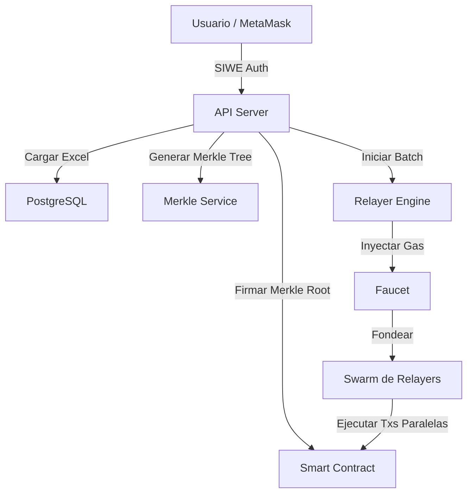

# 📔 Documentación Completa del Proyecto: Next-Gen USDC Distribution

## 🚀 Visión General
**Spectral Celestial - Next-Gen USDC Distribution** es una plataforma de grado industrial diseñada para la automatización de pagos masivos en USDC sobre la red **Polygon**. Utiliza una arquitectura de **Swarm de Relayers** y validación criptográfica mediante **Merkle Trees** para garantizar eficiencia, seguridad y scalabilidad sin precedentes.

---

## 🏗️ Arquitectura del Sistema

El sistema se basa en un modelo de micro-servicios y componentes altamente desacoplados para garantizar la resiliencia.

### 1. Componentes Core
- **Smart Contract (`contracts/BatchDistributor.sol`)**: El custodio descentralizado. Realiza la validación criptográfica de las pruebas Merkle, procesa los permisos EIP-2612 (Permit) y ejecuta las transferencias finales de USDC.
- **API Server (`server.js`)**: Basado en Express.js, actúa como el orquestador principal, manejando la autenticación SIWE, la gestión de sesiones en PostgreSQL y la exposición de endpoints REST.
- **Relayer Engine (`services/relayerEngine.js`)**: El "motor" del sistema. Orquesta la ejecución paralela de miles de transacciones utilizando una flota de wallets temporales (Relayers).
- **Faucet Service (`services/faucet.js`)**: Gestiona la infraestructura de gas. Cada usuario tiene su propia Faucet que alimenta a los relayers de sus lotes.
- **Encryption Service (`services/encryption.js`)**: Implementa encriptación **AES-256-GCM** para proteger claves privadas en la base de datos, reemplazando dependencias externas como HashiCorp Vault.
- **RPC Manager (`services/rpcManager.js`)**: Gestiona la conexión con múltiples nodos RPC de Polygon, ofreciendo failover automático y balanceo de carga.

---

## 🔐 Smart Contract: BatchDistributor

El contrato inteligente es el punto de verdad final en la blockchain. Está diseñado para ser eficiente en gas y extremadamente seguro.

### Funciones Principales:
- **`setBatchRootWithSignature`**: Permite registrar el Merkle Root de un lote de forma "gasless" para el Funder. El Funder firma la autorización off-chain (EIP-712) y el sistema (vía Faucet) paga el gas para registrarla.
- **`executeWithPermit`**: Esta es la función más avanzada. Recibe una firma **EIP-2612 (Permit)** del Funder. En una sola transacción atómica, el contrato:
    1. Valida el permiso de la Cold Wallet para mover USDC.
    2. Valida la prueba Merkle de la transacción específica.
    3. Ejecuta la transferencia de fondos al destinatario.
- **`executeTransaction`**: Utilizada para ejecuciones estándar una vez que la autorización (Allowance) ya está presente.
- **`verifyMerkle`**: Implementación optimizada de validación de ramas Merkle para prevenir cualquier manipulación de montos o destinatarios.

### Seguridad on-chain:
- **Protección de Re-entry**: Cada "hoja" del Merkle Tree (transacción individual) se marca como procesada en `processedLeaves` para evitar dobles pagos.
- **Aislamiento de Lotes**: Los Merkle Roots están vinculados a la dirección del Funder y un ID de lote, garantizando que un root no sea válido para el lote de otro usuario.

### 2. Flujo de Datos


---

## 📂 Estructura del Proyecto

```text
├── contracts/          # Smart Contracts (Solidity) - USDC Distributor
├── docs/               # Documentación técnica detallada
│   ├── ENCRYPTION_ARCHITECTURE.md
│   └── SYSTEM_ARCHITECTURE.md
├── public/             # Frontend (HTML/JS/CSS)
│   ├── app.js          # Lógica principal del Dashboard
│   ├── index.html      # UI Principal
│   └── style.css       # Sistema de diseño "Deep Space"
├── services/           # Lógica de negocio (Backend)
│   ├── relayerEngine.js# Motor de ejecución masiva
│   ├── faucet.js       # Gestión de gas
│   └── encryption.js   # Seguridad de llaves
├── scripts/            # Utilidades de mantenimiento y DevOps
├── server.js           # Orquestador principal de la API
└── schema.sql          # Esquema relacional de PostgreSQL
```

---

## ⚡ Funciones Críticas y Procesos

### 1. Merkle Distribution (Seguridad)
En lugar de iterar sobre una lista en el contrato (que costaría millones en gas), el sistema registra un **Merkle Root**. Cada transacción es una "hoja" que el usuario puede reclamar o, en nuestro caso, que los **Relayers** envían aportando la prueba criptográfica. Esto reduce el costo on-chain a niveles mínimos y constantes.

### 2. Swarm Parallelization (Velocidad)
El `RelayerEngine` divide un lote (ej. 1000 pagos) en N trabajadores. Si se configuran 100 relayers, el sistema procesa ~10-15 transacciones por segundo, superando las limitaciones de nonce secuencial de una wallet tradicional.

### 3. Self-Healing (Resiliencia)
- **Nonce Repair**: Si una transacción se queda atascada en la Faucet, el sistema detecta el bloqueo y envía automáticamente una transacción de "limpieza" con gas agresivo.
- **Stale Recovery**: Transacciones que quedan en estado "ENVIANDO" por más de 3 minutos son reseteadas automáticamente a "PENDING" para ser tomadas por otro relayer.

---

## 🎯 Casos de Uso
1. **Nóminas Internacionales**: Pago de salarios a cientos de empleados globalmente en minutos usando USDC.
2. **Distribución de Rewards**: Envío de incentivos a comunidades DeFi o usuarios de dApps.
3. **Airdrops de Precisión**: Distribución de fondos con validación Merkle para garantizar que solo direcciones autorizadas reciban el monto exacto.

---

## 🌟 Diferenciadores y Avances (v3.5.0)

El sistema ha evolucionado de un simple script a una plataforma Enterprise. Sus mayores innovaciones son:

| Característica | Detalle Tecnológico | Ventaja |
| :--- | :--- | :--- |
| **Arquitectura de Swarm** | Flota de hasta 100 relayers concurrentes. | Escalabilidad masiva y bypass de congestión. |
| **Autonomía Gas-Less** | Gestión de Faucets con auto-fondos. | El administrador no necesita enviar gas manualmente. |
| **Seguridad Soberana** | AES-256-GCM nativo en DB. | No depende de servicios externos (Vault), mayor control. |
| **Multi-RPC Failover** | Rotación dinámica entre 5 proveedores RPC. | Inmunidad a caídas de nodos o rate-limiting. |
| **Deep-Insight UI** | Dashboard con monitoreo en tiempo real y métricas. | Visibilidad total del costo, tiempo y éxito del lote. |
| **Nuclear Sweep** | Recuperación global de fondos al finalizar. | Cero desperdicio de MATIC/POL en wallets temporales. |

---

## 📈 Avances Recientes
- **Migración Exitosa de Vault a DB**: Reducción de latencia en 300ms por operación.
- **Optimización de Batch Processing**: Reducción del tiempo de ejecución en un 40% mediante ajustes en el loop de trabajadores.
- **Reporting Avanzado**: Generación de recibos descargables y exportación a Excel con logs detallados.

---
*Spectral Celestial - Engineering the future of decentralized payments.*
